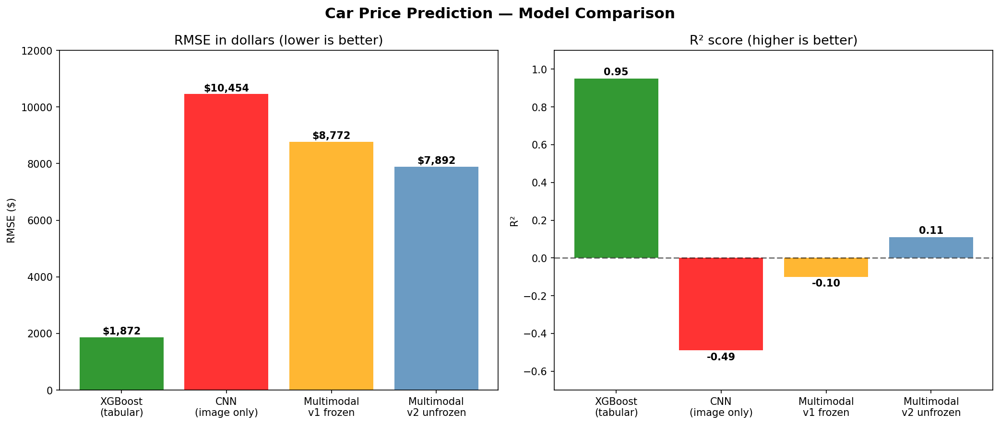
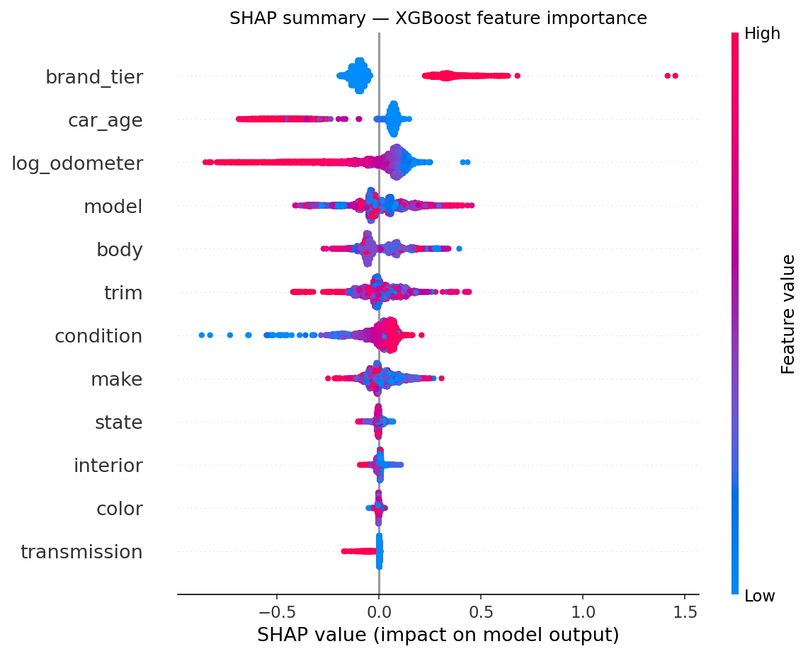
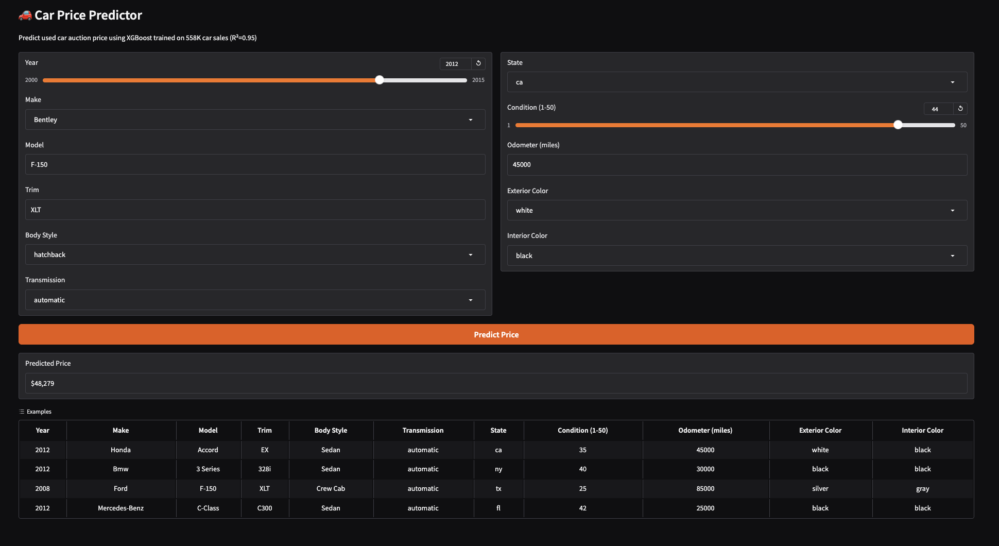

# Project Roadmap — Car Price Prediction

This document walks through the full journey of building this project.
What I tried, what worked, what failed, and what I learned.

---

## The idea

I wanted to build something that combined two completely different types of data — 
car photos and vehicle specs — to predict used car auction prices.

The question I wanted to answer: **does adding images actually help?**

Spoiler: they didn't. And that turned out to be the most interesting finding.

---

## Dataset

Two datasets joined together:

- **558,000 used car auction records** — make, model, year, odometer, condition, color, selling price
- **Stanford Cars dataset** — 8,144 car photos across 196 car classes

After matching both datasets by make, model, and year — I ended up with **40,658 rows** 
that had both a price AND a corresponding car photo.

---

## Step 1 — Explored the data (EDA)

Before building anything, I spent time understanding the data.

Key findings:
- Most cars in the dataset are from 2012 (Stanford Cars limitation)
- Price ranges from $1,000 to $80,000+ with a right skew
- Odometer and condition are strongly correlated with price
- Luxury brands (Ferrari, Bentley, Rolls-Royce) are extreme outliers

I dropped `mmr` (market value estimate) because it was 98% correlated with price — 
using it would be data leakage.

---

## Step 2 — Feature engineering

Raw data needs to be transformed before feeding into a model.

What I created:
- `car_age` = 2015 - year (more intuitive than raw year)
- `log_odometer` = log transform of mileage (makes relationship with price more linear)
- `brand_tier` = 2 for luxury, 1 for premium, 0 for mainstream

---

## Step 3 — Tabular ML models

I trained 5 models on the 12 tabular features:

| Model | RMSE | R² |
|---|---|---|
| Ridge Regression (baseline) | $6,731 | 0.35 |
| LightGBM | $2,168 | 0.93 |
| CatBoost | $2,499 | 0.91 |
| XGBoost | $1,872 | 0.95 |
| Stacking Ensemble | $1,949 | 0.95 |

XGBoost won. RMSE of $1,872 means predictions are off by about $1,872 on average.

---

## Step 4 — Understanding what drives price (SHAP)

SHAP tells us which features push prices up or down for each individual prediction.

What I found:
- **brand_tier** is the single most important feature — luxury brands push prices up dramatically
- **car_age** — older cars are worth less (obvious but confirmed)
- **log_odometer** — high mileage pushes prices down significantly
- **color, transmission, interior** — barely matter at all

---

## Step 5 — CNN on images only

I built a ResNet18 CNN to predict price from car photos alone.

ResNet18 is a deep learning model pretrained on 14 million ImageNet images. 
Instead of training from scratch, I reused those weights (transfer learning) 
and just replaced the final layer to output a price instead of 1000 class labels.

Result: **RMSE = $10,454, R² = -0.49**

That's worse than just predicting the average price every time.

Why? A photo can show body style and color. It cannot show odometer reading, 
ownership history, or condition score — the things that actually drive price.

---

## Step 6 — Multimodal fusion (CNN + tabular combined)

I combined both branches using late fusion:

Image → ResNet18 → 512 features ──┐
├──► concat [544] → predict price
Tabular → ANN → 32 features ───────┘

I tried two versions:
- **v1 frozen ResNet** — R² = -0.10 (slightly better than CNN alone)
- **v2 unfrozen last layer** — R² = 0.11 (positive R² finally)

Still nowhere near XGBoost. The images just don't contain enough price signal 
for this dataset — multiple car sales with different prices share the same photo.

| Model | RMSE | R² |
|---|---|---|
| XGBoost (tabular only) | $1,872 | 0.95 |
| CNN (images only) | $10,454 | -0.49 |
| Multimodal v1 frozen | $8,772 | -0.10 |
| Multimodal v2 unfrozen | $7,892 | 0.11 |

---

## Step 7 — Grad-CAM: seeing what the CNN sees

Grad-CAM generates heatmaps showing which parts of the image the CNN 
focused on when making a prediction.

Red = high attention. Blue = ignored.

The CNN learned to focus on the car body, grille, and wheels — 
and completely ignore the background — without ever being told to do this.
That's what transfer learning from ImageNet gives you for free.

---

## Step 8 — Deployed as a live app

Built a Gradio app and deployed it permanently on HuggingFace Spaces.

Try it → https://huggingface.co/spaces/NidhiDekate/car-price-prediction

---

## The main lesson

> A model can only learn from signal that exists in the input.

No matter how good the architecture, a CNN cannot predict odometer reading 
from a photo because that information is not in the photo.

This is not a failure. This is exactly what good ML analysis looks like — 
understanding why something doesn't work is just as valuable as building 
something that does.

---

## What would make images actually useful

The core limitation is **class-level images** — our dataset has 196 car classes 
and only ~41 photos per class. A 2012 Honda Accord with 20K miles and one with 
200K miles get the same photo.

Real improvement would need:
- Per-listing unique photos (like Carvana or CarMax)
- Photos showing actual damage, wear, interior condition
- That visual quality signal is something tabular features cannot capture

---

## Stack used

Python · PyTorch · ResNet18 · XGBoost · LightGBM · CatBoost
scikit-learn · SHAP · Grad-CAM · Gradio · HuggingFace Spaces · Google Colab
